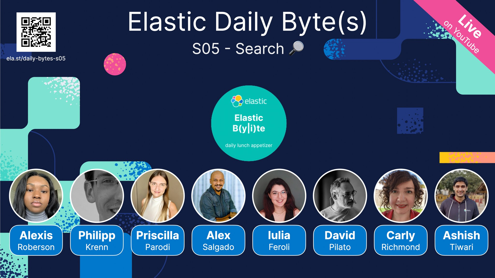

### Eland Model Import | Elasticsearch & Python

**Everyday at 11:45AM** (CET - European) during 3 weeks and for **only 8 minutes**, we are live on [YouTube](https://www.youtube.com/playlist?list=PL_mJOmq4zsHa6Ii4LArg_r1l08FHleaCl), explaining many things related to text search. 

It started with [the basics of the Search API](https://www.youtube.com/watch?v=p0KcxhipvbU), then we covered [text analysis](https://www.youtube.com/watch?v=YFkKZSLRSSY) and some [text queries](https://www.youtube.com/watch?v=8yAsuiU51xw), [runtime fields](https://www.youtube.com/watch?v=HpjxfS5rrhI) and [synonyms](https://www.youtube.com/watch?v=eDoxEF11T_4) and the brand new API that landed in 8.10. 

This episode covers using Eland to enrich your data with ML and NLP!

Video for this episode: https://www.youtube.com/watch?v=QjkRLuSYGiQ 

See [Notebook here](/Eland_bytes.ipynb)
